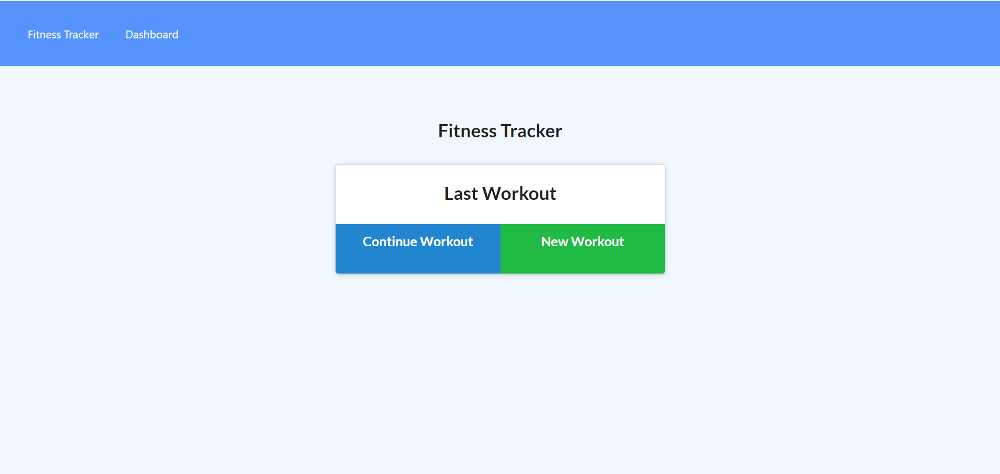

# Workout Tracker 
  
# Description
This application allows the user to track their workouts and the indvidual exercises that occu withi each workout. The user can also see graphs outlining data from their last 7 workouts.

# Table of Contents
- [Installation](#installation)

- [Usage](#usage)

- [License](#license)

- [Contributing](#contributing)

# Installation
Link

# Usage
Simply follow the link to the site and begin creating workouts and adding exercises to those workouts.

# License 
    This project uses the The MIT License license.
    
    License Link: https://opensource.org/licenses/MIT

# Contributing
This application is not currently accepting contributions.

# Tests
N/A

# Questions
Github: [dmcaulay97](https://github.com/dmcaulay97)

Email: dmcaulay97@gmail.com
  